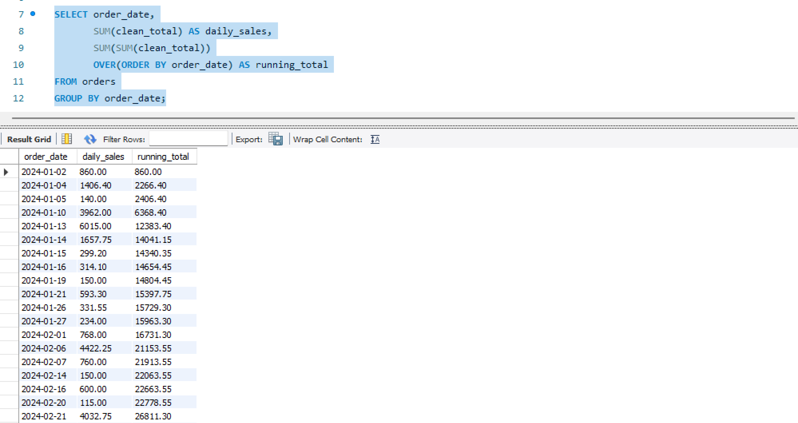
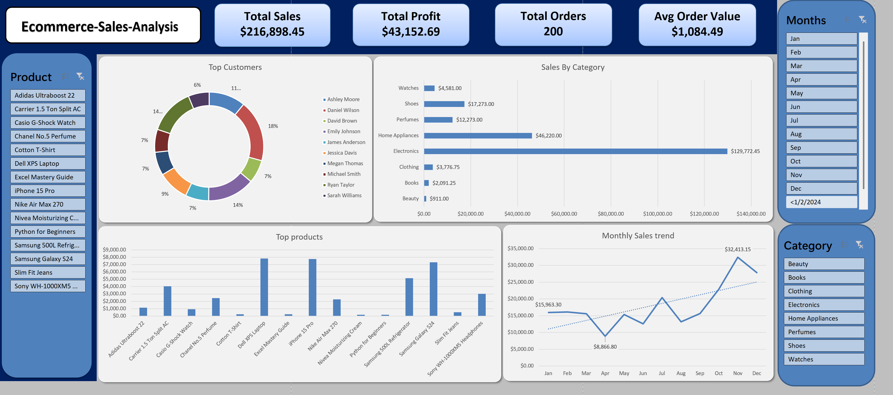
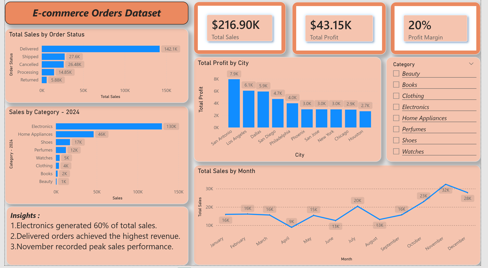

# E-Commerce Orders Analysis Dashboard

## Project Overview
This project presents a complete E-Commerce Sales Analysis Dashboard built using SQL, Excel, and Power BI.

The purpose of this project is to analyze sales performance, customer behavior, product trends, and profitability to generate valuable business insights and support data-driven decision making.

The dashboard provides interactive visualizations for:
- Sales Performance
- Profit Analysis
- Product Analysis
- Customer Insights
- Payment Methods
- Order Status Tracking
- Monthly Sales Trends

---

# Tools & Technologies Used

- SQL
- Excel
- Power BI
- GitHub

---

# Dataset Information

The dataset contains e-commerce transaction records including:

- Order Details
- Customer Information
- Product Categories
- Brands
- Sales & Profit
- Discounts
- Shipping Cost
- Payment Methods
- Customer Ratings
- Order Status

---

# Key Business Questions

This project answers important business questions such as:

- Which products generate the highest sales?
- Which cities generate the highest profit?
- What are the top-performing categories?
- Which customers contribute the most revenue?
- Which payment methods are most popular?
- How do order statuses affect revenue?
- What are the monthly sales trends?

---

# Dashboard Pages

## 1. Executive Overview
Includes:
- Total Sales
- Total Profit
- Total Orders
- Sales by Category
- Sales by Order Status
- Monthly Sales Trend
- Profit by City

---

## 2. Product Analysis
Includes:
- Top Selling Products
- Sales by Brand
- Profit vs Sales Comparison
- Category Performance

---

## 3. Customer Analysis
Includes:
- Top Customers
- Customer Profit Contribution
- Sales by Payment Method
- Customer Ratings Analysis

---

# Key KPIs

| KPI | Value |
|------|------|
| Total Sales | $216.9K |
| Total Profit | $43.1K |
| Profit Margin | 20% |


---

# Key Insights

- Electronics generated the highest sales among all categories.
- Delivered orders contributed the majority of total revenue.
- Samsung and Apple products achieved strong sales performance.
- November recorded the highest monthly sales.
- Apple Pay and Cash on Delivery were the most used payment methods.
- A small group of customers contributed significantly to total profit.

---

# SQL Analysis Included

The project includes SQL queries for:
- Data Cleaning
- Sales Analysis
- Customer Ranking
- Running Totals
- Window Functions
- CTEs (Common Table Expressions)

---

# Power BI Features Used

- Interactive Dashboards
- KPI Cards
- Slicers & Filters
- DAX Measures
- Data Modeling
- Dynamic Visualizations

---

# Project Structure

```text
Ecommerce-Sales-Analysis/
│
├── data/
│   └── ecommerce_dataset.csv
|
├── excel/
│   └── ecommerce_dataset_EN.xlsx
|
│
├── sql/
│   ├── data_cleaning.sql
│   ├── important_analysis.sql
│   ├── KPIs.sql
│   └── advanced_queries.sql
│
├── powerbi/
│   └── ecommerce_dashboard.pbix
│
├── images/
│   ├── order_sql.png
│   ├── product_png
│   ├── customer_sql.png
│   ├── excel_dashboard.png
│   ├── executive_dashboard.png
│   ├── product_analysis.png
│   └── customer_insights.png
│
└── README.md
```

---

# Dashboard Preview

## Order SQL


## Excel Dashboard


## Executive Dashboard


---

# Future Improvements

Potential future enhancements:
- Sales Forecasting
- Customer Segmentation
- RFM Analysis
- Inventory Optimization
- Predictive Analytics

---

# Author

## Mohamed Elbaz

Aspiring Data Analyst passionate about:
- SQL
- Power BI
- Excel
- Data Visualization
- Business Intelligence

---

# Connect With Me

- LinkedIn: https://www.linkedin.com/in/mohamd-elbaz-a11a823b0/
- GitHub: https://github.com/mohamdelbaz-Data
